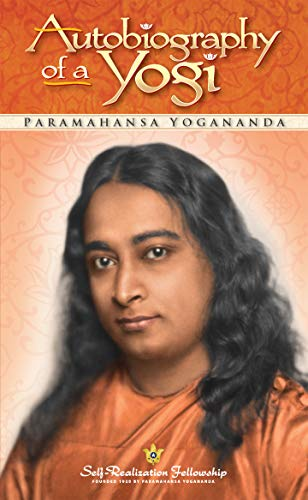

# Autobiography of a Yogi - Parmahansa Yogananda

## The Book In 3 Sentences

Parmahansa Yogananda presents a rare account of his very unique life as an Indian monk elucidating on his supernatural experiences with other Yogis and promulgating the practice of meditation and Kriya Yoga. The Sacred Guru-Disciple relationship, law of karma and the unwritten law for the truth seeker being patience are the three main lessons expounded on. Yoga and meditation is the solution to all problems.

## My 411

Autobiography of a Yogi is my favorite book of all time and I am happy to have finished my 11th annual pilgrimage to the mind of Parmahansa Yogananda. There is no other autobiography that makes me laugh as hard,  leaves me in goosebumps and a state of wonder - every other one wanes in comparison. Every single time I have read this book, there is a sense of peace during the hypnogogic state  each time I put the book down after my nightly reading as I drift off to a comfortable place. I learn something new from this book every time I read it - whether it is vocabulary or contextualization of the lessons based on my state of mind at the time. 

I am incredibly lucky to have moved only a 20 minute drive from the Self Realization Center in Encinitas and today, 5th of March, I visited the meditation gardens. Perfect timing after finishing this book!

## Notes

### My Favorite Quotes

1. “Do not mistake the technique for the Goal.”
2. Grateful friends are only the Lord in disguise, looking after His own.
3. Every individual in the world has inalienable right to his free will. A saint will not encroach upon that independence.
4. He is a fool that cannot conceal his wisdom.
5. Good manners without sincerity are like a beautiful dead lady, Straightforwardness without civility is like a surgeon’s knife, effective but unpleasant. Candor with courtesy is helpful and admirable.
6. A worthy leader has the desire to serve, and not to dominate.
7. Keen intelligence is two-edged.It may be used constructively or destructively like a knife, either to cut the boil of ignorance, or to decapitate one’s self. Intelligence is rightly guided only after the mind has acknowledged the inescapability of spiritual law. 
8. Just as the purpose of eating is to satisfy hunger, not greed, so the sex instinct is designed for the propagation of the species according to natural law, never for the kindling of insatiable longings.
9. The forceful activating impulse of wrong desire is the greatest enemy to the happiness of man.
10. Do not confuse understanding with a larger vocabulary. Continual intellectual study results in vanity and the false satisfaction of an undigested knowledge.
11. When your conviction of a truth is not merely in your brain but in your being, you may diffidently vouch for its meaning.
12. Endless literary controversy is for sluggard minds.
13. Saints are not produced in batches every semester like accountants.
14. Some people try to be tall by cutting off the heads of others!
15. Storm those inner citadels of wrath and egotism whose fall is the height of a man.
16. Wisdom is better sought from a man of realization than from an inert mountain.
17. What one does not trouble to find within will not be discovered by transporting the body hither and yon.
18. Are you able to have a little room where you can close the door and be alone? That is your cave. That is your sacred mountain. That is where you will find the kingdom of God.
19. In superconsciousness, the internal organs remain in a state of suspended animation, electrified by the cosmic energy.
20. Wrath springs only from thwarted desires. 
21. I do not expect anything from others, so their actions cannot be in opposition to wishes of mine.
22. A master bestows the divine experience of cosmic consciousness when his disciple, by meditation, has strengthened his mind to a degree where the vast vistas would not overwhelm him.
23. Spiritual advancement is not measured by one’s outward powers, but only by the depth of his bliss in meditation.
24. Astrology is the study of man’s response to planetary stimuli.
25. The wise man defeats his planets — which is to say, his past — by transferring his allegiance from the creation to the Creator.
26. It is only when a traveler has reached his goal that he is justified in discarding his maps.
27. Seeds of past karma cannot germinate if they are roasted in the divine fires of wisdom.
28. The deeper the self-realization of a man, the more he influences the whole universe by his subtle spiritual vibrations, and the less he himself is affected by the phenomenal flux.
29. The starry inscription at one’s birth, I came to understand, is not that man is a puppet of his past. His freedom is final and immediate, if he so wills; it depends not on outer but inner victories.
30. The ‘serpent’ represents the coiled-up spinal energy which stimulates the sex nerves. ‘Adam’ is reason, and ‘Eve’ is feeling.
31. The personal responsibility of every human being is to restore his ‘parents’ or dual nature to a unified harmony or Eden.
32. In as much as great masters seldom see fit to display their powers openly, a casual observer of the day’s events would have imagined that their sequence was quite natural.
33. The metaphysical method of physical transfer of disease is known to highly advanced yogis. A strong man can assist a weaker one by helping to carry his heavy load; a spiritual superman is able to minimize his disciples’ physical or mental burdens by sharing the karma of their past actions.
34. A master willingly sacrifices a portion of his bodily wealth to lighten the misery of disciples.
35. By putting on the ailments of others, a yogi can satisfy, for them, the karmic law of cause and effect.
36. Only a self-realized master can transfer his life force.
37. The acid test of a master is a man’s ability to enter at will the breathless state, and to maintain the unbroken samadhi of nirbikalpa.
38. The words of St. Francis de Sales: “A saint that is sad is a sad saint!”
39. Lahiri Mahasaya often said: ‘If you don’t invite God to be your summer Guest, He won’t come in the winter of your life.’”
40. Yoga is a method for restraining the natural turbulence of thoughts, which otherwise impartially prevent all men, of all lands, from glimpsing their true nature of Spirit.
41. The ancient rishi Patanjali defines “yoga” as “control of the fluctuations of the mind-stuff.”
42. The Bhagavad Gita points out that the methods of yoga are all-embracive.
43. A true yogi may remain dutifully in the world; there he is like butter on water.
44. To fulfill one’s earthly responsibilities is indeed the higher path, provided the yogi, maintaining a mental uninvolvement with egotistical desires, plays his part as a willing instrument of God.
45. The ancient yogis discovered that the secret of cosmic consciousness is intimately linked with breath mastery. The life force, which is ordinarily absorbed in maintaining the heart-pump, must be freed for higher activities by a method of calming and stilling the ceaseless demands of the breath.
46. The body of the average man is like a fifty-watt lamp, which cannot accommodate the billion watts of power roused by an excessive practice of Kriya.
47. The ancient Vedic scriptures declare that the physical world operates under one fundamental law of maya, the principle of relativity and duality.
48. After man has gone through a few thousand human births; he begins to cast a hopeful eye beyond the compulsions of maya.
49. The yogi who thus denudes the universe is the only true monotheist. All others are worshiping heathen images.
50. Maya or avidya can never be destroyed through intellectual conviction or analysis, but solely through attaining the interior state of nirbikalpa samadhi.
51. Among the trillion mysteries of the cosmos, the most phenomenal is light.
52. Light remains the most subtle, the freest from material dependence, of any natural manifestation.
53. Einstein has banished from the cosmos every fixed reality except that of light.
54. Great scientists are now boldly asserting the atom is energy rather than matter, but that atomic energy is essentially mind-stuff.
55. The wave quality gave the electron the characteristic of light.
56. Only a material body whose mass is infinite could equal the velocity of light.
57. The masters who are able to materialize and dematerialize, have fulfilled the necessary Einsteinian condition: their mass is infinite.
58. A yogi rearranges the light atoms of the universe to satisfy any sincere prayer of a devotee.
59. For this purpose were man and creation made: that he should rise up as master of maya, knowing his dominion over the cosmos.
60. Creation is light and shadow both, else no picture is possible. The good and evil of maya must ever alternate in supremacy.
61. A clue to the direction taken by Einstein’s genius is given by the fact that he is a lifelong disciple of the great philosopher Spinoza, whose best-known work is Ethics Demonstrated In Geometrical Order.
62. Liberation is dependent on inner, rather than outer, renunciations.
63. Truth is for earnest seekers, not for those of idle curiosity.
64. He only is wise who devotes himself to realizing, not reading only, the ancient revelations.
65. Memory is not a test of truth; just because man fails to remember his past lives does not prove he never had them. Memory is blank concerning his womb-life and infancy, too; but he probably passed through them!
66. Evil is pointed out to them as being that which produces misery; good as those actions which result in true happiness. Evil may be compared to poisoned honey, tempting but laden with death.
67. Arising from immemorial roots, past experiences of death, is present in slight degree even in great saints. ~Patanjali
68. Three bodies
    1.  the idea, or causal body:
        1.  intellectual man
    2.  the subtle astral body, seat of man’s mental and emotional natures.
        1.  energetic man
    3.  the gross physical body.
        1.  material man
69. causal-body (35 elements) = astral body of 19 elements + gross physical body of 16 elements
70. The adhesive force by which all three bodies are held together is desire. The power of unfulfilled desires is the root of all man’s slavery.
71. If a dreamer is contacting his astral and not his causal body; his sleep is not fully refreshing.
72. Only when a being has no further desires for experiences.
73. A kria technique which frees the body from dependence on the gross food of mortals.
    1.  The technique includes the use of a certain mantra and a breathing exercise more difficult than the average person could perform. No medicine or magic is involved; nothing beyond the kria.
74. A person who truly feels: ‘The world is my homeland’ will never lack scope for a useful and happy life.
75. Man is a soul, not an institution; his inner reforms alone can lend permanence to outer ones.

