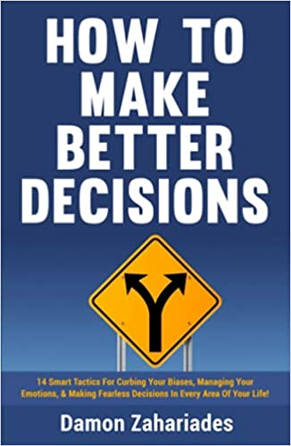

# How To Make Better Decisions - Damon Zahariades

## The Book In 3 Sentences

## My 411

## Notes

1. __Introduction__
   1. Decisions shape our lives.
   2. Making wrong decisions is usually a function of overlooked variables and cognitive biases.
   3. Important that we accept responsibility for our lives.
2. __How We Make Decisions__
   1. __The Role of Emotions in Decision Making__
      1. Emotions may seem counterproductive but they should be a welcome trait. 
      2. We need emotions to live rewarding lives.
      3. Emotions are sometimes valuable guides.
      4. We should prevent our emotions from playing a dominant role in our decision making.
         1. Emotions paralyze it: They may invoke fear and anxiety in the face of uncertainty.
         2. Emotions open the door to biases.
            1. Our personal feelings make cause us to be more biased towards some options, neglecting others.
      5. Emotions _should_ play a role when our choices involve our values and convictions.
   2. __The Role of Values in Decision Making__
      1. Values inform our goals and give us purpose.
      2. When we allow our values guide our decisions, we feel less troubled by the risks.
   3. __Weighing the Cost vs. Benefit of Our Decisions__
      1. Every decision we make is a trade-off - everything decision has an opportunity cost.
      2. Each option we choose from carries benefits.
      3. Trade offs are present in every decision we make - from the trivial to consequential.
      4. GOAL: Maximize the benefits we enjoy from our decisions while minimizing their attendant costs.
3. __Why We Make Poor Decisions__
   1. __Unmanaged Emotions__ 
      1. Emotions are a double-edged sword when it comes to decision as they are important for any decision.
      2. Emotions help us understand our present circumstance.
      3. __Why It's Bad__
         1. If we fail to manage our emotions we either:
            1. Don't act.
            2. Act without considering all the variables.
      4. __Solution__: Being aware of our emotional state makes us more aware of the stakes inherent in our choices.
         1. The awareness can spur us to make better-reasoned decisions.
   2. __False Sense of Urgency__
      1. We prioritize taking action over contemplation.
      2. __Cause__: Impatience and impulse towards busyness and a mistaken correlation between said busyness and productivity and progress.
      3. __Why It's Bad__ 
         1. False sense of urgency can pressure us to be more decisive and it can cause of to make terrible decisions.
         2. We overlook pertinent information and valid options.
         3. We quash conflicting information or dissenting opinions.
      4. If there is no reason to act immediately, take time to consider the relevant variables and thoroughly evaluate our options.
   3. __Lack of Urgency__
      1. Procrastination leads to indecision.
      2. Procrastination is an emotional response to our circumstances.
      3. __Why It's Bad__
         1. Procrastination is problematic because it is often accompanied by other negative emotions.
         2. Leads to indecisiveness.
         3. Impedes our ability to make decisions that lead to desired outcomes.
   4. __Overoptimism__
      1. "We are unlikely to experience any negative events". 
      2. __Why It's Bad__ 
         1. Encourages us to rush into decisions. 
         2. Underestimating the risks involved.
         3. Unchecked optimism leads to making less accurate decisions.
         4. It causes to forge ahead without sufficiently evaluating information, options, risks that are pertinent to our decisions.
   5. __Loss Aversion__
      1. Fear of losing something.
      2. __Why It's Bad__
         1. Hamstrings our ability to make well reasoned decisions. i
         2. Our fear of losing something we value causes us to be unduly vary.
   6. __Concerning Our Public Image__
      1. We care about what others think about us.
      2. __Why It's Bad__
         1. A high level of obsession of it can cause us to reach a level of unintended obsession.
         2. It prompts us to dismiss reasonable, even preferable, options because they fail to align with other's opinions.
         3. Your concern with other's perception of your opinions / decisions impedes your own ability to make wise choices due to anxiety. 
4. __10 Cognitive Biases That Impact Our Decisions__
   1. __Introduction__
      1. Cognitive biases are mental shortcuts.
      2. Cognitive biases often distort our perceptive of reality. They prompt us to make hasty, reckless and erroneous judgments.
      3. They lead to blind spots.
      4. Outsmarting our biases is crucial to our ability to make well-reasoned decisions.
      5. Half the battle won if you acknowledge the bias in a particular situation.
   2.  __Type 1: Anchoring Bias__
       1.  __What Is This Bias?__: Being overtly influenced by the first piece of information we find out about serving as the reference point to which we compare and judge each option.
       2.  __Why Is This Bias Bad?__: This bias is bad because it induces tunnel vision.
       3.  __Examples__
           1.  You see a t-shirt costing $1,200 and then one for $100, you are inclined to think the second one is cheap, however, $100 is very expensive for a t-shirt and you can buy one cheaper elsewhere.
           2.  "Where will the price of AAPL be in 3 months"
               1.  We are inclined to look at today's price as the starting point. 
               2.  Warren Buffet ignores the price and looks primarily at fundamentals.
           3.  Showrooms put the most expensive cars in front.
           4.  Seeing a product on Amazon and not considering alternatives even if the price isn't what I want to pay because I am used to the convenience.
           5.  When analysts find their evaluation is far out from the actual stock price, they often try to change their evaluation to match the market because they are influenced by the current price (the anchor).
       4.  __How To Beat Anchoring Bias__
           1.  __Acknowledge!__
               1.  Acknowledge the anchor established by your brain.
           2.  __Step Back and Take Your Time__
               1.  "What am I willing to pay for this?"
               2.  Write a check before you visit the car showroom and don't beyond it.
           3.  __Beat the Anchor by Setting Your Own Anchor__
               1.  Set an anchor that's more in line with your beliefs / budget.
   3.  __Type 2: Confirmation Bias__
       1.  __What Is This Bias?__: Preconceived beliefs and opinions are overvalued and ultimately result in detracting from consideration of all other information.
       2.  __Why Is This Bias Bad?__: 
           1.  We make decisions on incomplete information without understanding the depths of all facts and details.
       3. __Examples__
          1. During the election campaign, people tend to look for information confirming their perspectives on different candidates while ignoring any information contradictory to their views.
          2. Existing beliefs of a certain group being more competent than the other is the reason why particular races and gender are represented the most in companies today. 
       4. __How To Beat Confirmation Bias__
          1. Challenge your opinions:
             1. Ask yourself what informs your opinions.
             2. Why do you hold them?
             3. Are they based on data rather than on emotions.
          2. Venture outside any echo chamber relevant to the decision in front of you.
             1. Extricate yourself from echo chambers e.g. social media before making the decision.
          3. Discuss your decision with those who hold opinions that differ from your own. 
   4. __Type 3: Availability Bias aka Availability Heuristic__: 
      1. __What Is This Bias?__: Greater gravity is assigned to information that comes to mind more quickly than information that doesn't.
      2. __Why Is This Bias Bad?__:
         1. Mental shortcut that highlights laziness when we are unable to conduct a full investigation.
         2. This leads to errors in thinking as we don't consider all options. 
         3. We make decisions on incomplete information and thus misleading information.
      3. __Examples__
         1. Plane crashes can make people afraid of flying. However, the likelihood of dying in a car accident is far higher than dying as a passenger on an airplane.
         2. __Climate change denial__: If you experience an unseasonably cold day, you may wonder how that supports climate change and a warming climate.
      4. __How To Beat Availability Bias__:
         1. Be Self Aware to Know That The Information We Recall Immediately Is Inadequate on It's Own.
         2. Conduct a deliberate inquiry into factors that are less obvious and thus come to mind less quickly.
   5. __Type 4: Optimism Bias__:
      1. __What Is This Bias?__: The belief that we are less susceptible to unfavorable outcomes than suggested by our circumstances.
      2. __Why Is This Bias Bad?__
         1. Unrealistic perspective makes us think we are in absolute control of the situation as we are overconfident in our abilities.
         2. When making decisions with unrealistic details can be detrimental.
      3. __Examples__
         1. Doing well financially so you don't save up for a emergency fund.
         2. Organizations not creating a risk management plan because they underestimate the likelihood of risks.
         3. Being confident about landing a job because you graduated from an elite educational institute.
      4. __How To Beat Optimism Bias__
         1. Adopt an outsider's view of our circumstance i.e. try to rely on realistic data than self-perceived information.
         2. View a decision from "what can go wrong" aka take a postmortem approach to decision making to short circuit overconfidence.
   6. __Type 5: Dunning Kruger Effect__
      1. __What Is This Bias?__: This bias encourages us to believe we're more competent than in actuality the case for a given situation. We trust we are smart enough, capable enough, and sufficiently informed before we proceed when in fact, we are not.
      2. __Why Is This Bias Bad?__:
         1. Overestimation of abilities and a lack of self awareness leads to errors.
         2. We don't have the full information to make an informed decision as we have overestimated our abilities and lack self awareness.
      3. __Examples__
         1. An amateur chess player overestimates their performance in the upcoming chess tournament compared to their competent counterparts.
         2. People who are poor performers in their work do not have any issue volunteering for extra work that can be over their capacity or skill set.
         3. Supporters of opposing political parties often express confidence in their expertise about ruling parties’ policies but they have the slightest idea about specific policies.
      4. __How To Beat the Dunning Kruger Effect__
         1. Have enough self awareness to know what you do and don't know.
            1. Understand the [curve](https://images.medicinenet.com/images/article/main_image/dunning-kruger-effect.jpg).
         2. Solicit feedback from others.
   7. __Type 6: Loss Aversion Bias__
      1. __What Is This Bias?__:  A cognitive bias that describes why, for individuals, the pain of losing is psychologically twice as powerful as the pleasure of gaining. This bias discourages us from making decisions altogether.
      2. __Why Is This Bias Bad?__
         1. Decisions aren't made out of fear of loss.
         2. Dissuades us from taking calculated reasoned risks.
         3. We reject our notions of taking sensible risks.
      3. __Examples__
         1. Selling a stock that has gone up slightly in price just to realize a gain of any amount, when your analysis indicates that the stock should be held longer for a much larger profit.
         2. Selling winning investments instead of losing investments for the sole reason of not accepting defeat.
      4. __How To Beat Loss Aversion Bias__
         1. Frame every decision from the perspective of risk and reward.
         2. Imagine worst case scenario for every decision.
   8. __Type 7: Survivorship Bias__
      1. __What Is This Bias?__: We tend to give more credence to people, events and ideas that succeed and flourish than to those that don't.
      2. __Why Is This Bias Bad?__
         1. Tunnel vision where you don't consider all options.
         2. Overoptimism and Overconfidence are both byproducts.
      3. __Examples__
         1. If three of the five students with the best college grades went to the same high school, that can lead one to believe that the high school must offer an excellent education when, in fact, it may be just a much larger school instead.
         2. “Bill Gates dropped out of college and he went on to become a billionaire. So did Mark Zuckerberg and Elon Musk. I think I should drop out too”.
      4. __How To Beat Survivorship Bias__
         1. Scrutinize the validity of our information.
            1. How reliable is it?
            2. Were we overly selective in choosing sources, giving undue priority to examples of success?
         2. Assume we're not seeing the entire picture.
            1. What are we missing?
            2. What are our blind spots.
         3. Scrutinize whether any example of success is an outlier.
   9.  __Type 8: Action Bias__
       1.  __What Is This Bias?__: This bias compels us to take action, even when we don’t know what to do.
       2.  __Why Is This Bias Bad?__
           1.  When we take action without good read i.e. to avoid inaction, we risk making bad decisions.
           2.  We act on impulse rather than choosing a logical course of action. 
       3.  __Examples__
           1.  Decision of a soccer goalkeeper during a penalty kick is to always move. Statistically this is shown to be negative.
       4. __How To Beat Action Bias__
          1. Recognize that doing nothing is not the same as conceding defeat.
             1. Doing nothing on impulse demonstrates self control.
          2. "Am I required to make a decision at this moment?"
             1. We are less impulsive after asking this question.
5. __14 Tactics For Making Better Decisions__
   1. __Introduction__
      1. There will always be uncertainty but we need tactics to take actions or decide to not take actions.
      2. These tactics serve as a good framework.
   2. __Tactic 1: Identify Your Desired Outcome (And Why It's Important To You)__
      1. It's important to know __exactly__ what we'd like to achieve before we make consequential decisions.
      2. "Start with the end in mind".
      3. __4 Questions To Ask__
         1. __"What do I want To achieve?"__
            1. Be as specific as possible.
         2. __"Why do I want to achieve this outcome?__
            1. Given the opportunity cost of doing other things, why is this outcome important?
         3. __"What will be required of me to achieve this outcome?"__
            1. What we'll need to sacrifice to bring it to fruition.
         4. __"Does this outcome complement my core values?"__
            1. Does this outcome align or detract from my core values?
      4. __When to use this?__
         1. Opportunity cost evaluation of multiple options.
         2. Before starting a particular trajectory - decide _why_ this is the option to go to. 