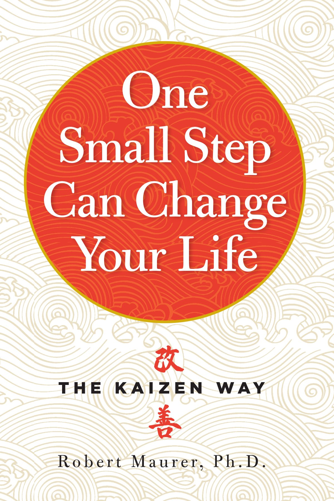

# One Small Step Can Change Your Life, The Kaizen Way - Robert Maurer

## The Book In 3 Sentences

Kaizen or continuous improvement claims that the art of making great and lasting change comes through small, steady steps. Why Kaizen works is because by making small, steady steps we bypass our bodily fight-or-flight mechanism and resistance to new behaviors to make progress without fear of failure. Small rewards lead to big returns and this is induced by asking small questions, thinking small thoughts, taking small actions, solving small problems, bestowing small rewards and identifying small moments. 

## My 411

An excellent short read definitely worth reading with some well substantiated examples and sage advice to inculcate Kaizen in any facet of life. 

## Notes

### Definition

Kaizen has two definitions:

1. Using very small steps to improve a habit
2. A process, or product using very small moments to inspire new products and inventions

Innovation, on the other hand, is a drastic change!

### Common Beliefs About Change
1. Myth #1: Change Is Hard
2. Myth #2: The Size of the Step Determines the Size of the Result, So Take Big Steps for Big Results
3. Myth #3: Kaizen Is Slow; Innovation Is Quicker

### Favorite Quotes

- “In our “bigger is better” culture of IMAX movies, supersize meals, and extreme makeovers, it’s hard to believe that small steps can lead to big changes. But the wonderful reality is that they can.”
- “There are two elements of the spirit, or purpose, in which kaizen plays an essential role: service and gratitude.”
- “Low-key change helps the human mind circumnavigate the fear that blocks success and creativity.”
- “All changes, even positive ones, are scary. Attempts to reach goals through radical or revolutionary means often fail because they heighten fear. But the small steps of kaizen disarm the brain’s fear response, stimulating rational thought and creative play.”
- “When you want to change but experience a block, you can often blame the midbrain for gumming up the works.”
- “Small, easily achievable goals—such as picking up and storing just one paper clip on a chronically messy desk—let you tiptoe right past the amygdala, keeping it asleep and unable to set off alarm bells.”
- “When you are afraid, the brain is programmed either to run or attack—not always the most practical options.”
Small actions satisfy your brain’s need to do something and soothe its distress.
- “Your brain is programmed to resist change. But, by taking small steps, you effectively rewire your nervous system so that it does the following: ‘unsticks’ you from a creative block bypasses the fight-or-flight response creates new connections between neurons so that the brain enthusiastically takes over the process of change and you progress rapidly toward your goal.”
- “When life gets scary and difficult, we tend to look for solutions in places where it is easy or at least familiar to do so, and not in the dark, uncomfortable places where real solutions might lie.”
- “Use times of difficulty to remember that fear is the body’s gift, alerting us to a challenge.”
- “Small questions create a mental environment that welcomes unabashed creativity and playfulness. When you ask small questions of others, you channel that creative force toward team goals. By asking small questions of yourself, you lay the groundwork for a personalized program for change.” (Sam: this is similar to Anthony Robbin’s strategy of asking “quality questions” in Awaken the Giant Within.)
- “The hippocampus’s main criterion for storage is repetition, so asking that question over and over gives the brain no choice but to pay attention and begin to create answers.”
- “Ask yourself, ‘If health were my first priority, what would I be doing differently today? What is one way I can remind myself to drink more water? How could I incorporate a few more minutes of exercise into my daily routine?’”
- “Your brain loves questions and won’t reject them … unless the question is so big it triggers fear.”
- “By asking small, gentle questions, we keep the fight-or-flight response in the ‘off’ position. Kaizen questions such as ‘What’s the smallest step I can take to be more efficient?’ allow us to bypass our fears.”
- “Make your questions small, and you reduce the chances of waking the amygdala and arousing debilitating fear. When fear is quiet, the brain can take in the questions and then pop out answers on its own timetable.”
- “If you tend to berate yourself with negative questions (Why am I so fat?), try asking: What is one thing I like about myself today? Ask this question daily, writing your answer down in a journal or on a sheet of paper you keep in a specially designated place.”
- “The easy technique of mind sculpture uses ‘small thoughts’ to help you develop new social, mental, and even physical skills—just by imagining yourself performing them!”
- “Small actions are at the heart of kaizen. By taking steps so tiny that they seem trivial or even laughable, you’ll sail calmly past obstacles that have defeated you before. Slowly—but painlessly!—you’ll cultivate an appetite for continued success and lay down a permanent new route to change.” (Sam: the idea of “taking steps so tiny that they seem trivial or even laughable” is similar to Stephen Guise’s strategy of making new habits stupidly small in Mini Habits.)
- “If you ever feel yourself dreading the activity or making excuses for not performing it, it’s time to cut back on the size of the step.”
- “We are so accustomed to living with minor annoyances that it’s not always easy to identify them, let alone make corrections. But these annoyances have a way of acquiring mass and eventually blocking your path to change. By training yourself to spot and solve small problems, you can avoid undergoing much more painful remedies later.”
- “Whether you wish to train yourself or others to instill better habits, small rewards are the perfect encouragement. Not only are they inexpensive and convenient, but they also stimulate the internal motivation required for lasting change.” (Sam: the idea of rewarding yourself for doing a new behavior is a crucial part of BJ Fogg’s Tiny Habits program.)
- “The larger the external rewards, the greater the risk of inhibiting or stunting the native drive for excellence.” (Sam: Dan Pink writes about this in Drive.)
- “The kaizen approach to life requires a slower pace and an appreciation of small moments. This pleasant technique can lead to creative breakthroughs and strengthened relationships, and give you a daily boost toward excellence.”
- “As you experience success in applying kaizen to clear goals like weight loss or career advancement, remember to hold on to its essence: an optimistic belief in our potential for continuous improvement.”

### Quality Questions

- “If you are unhappy but aren’t sure why, try asking yourself this: If I were guaranteed not to fail, what would I be doing differently?”
- “If you are trying to reach a specific goal, ask yourself every day: What is one small step I could take toward reaching my goal?”
- “What is one small step I could take to improve my health (or relationships, or career, or any other area)?”
- “Is there a person at work or in my personal life whose voice and input I haven’t heard in a long time? What small question could I ask this person?”
- If somebody’s annoying you, ask yourself, “What’s one good thing about this person?”
“What is one small thing that is special about me (or my spouse, or my organization)?”

### Other Notes

1. Accumulation of small problems over a long period of time break systems. 
2. Addictions are a symptom of a lack of support. You get addicted to things / behaviors as a result of getting a lack of comfort.
3. Humans have 3 types of brains:
   1. Reptile Brain
   2. Mammalian Brain
   3. Cortex 
4. Amygdala in the Mammalian Brain is in charge of the fight or flight mechanism. The name of the game is to bypass this so that fear doesn't derail progress.
5. Hippocampus is responsible for memory. Repetition allows the retrieval of memories / behaviors from it easier.
6. The larger the external rewards, the greater the risk of inhibiting or stunting the native drive for excellence.
   1. Big prizes remove "intrinsic motivation".
7. Study by Dr. John Gottman of successful relationships with 93% accuracy concluded: positive attention outweighed negative on a daily basis by a factor of five to one. Examples include:
   1. Using pleased tone of voice when receiving a phone call from the partner. 
   2. Inquiring about details of the person's day.
   3. Putting down things when the partner gets in.
   4. Arriving home at the promised time.
   5. Small details in your partners life.
   6. Praise not only actions but personality and appearance.
8. Small moments turn out to be more predictive of a loving, trusting relationship than innovative steps of romantic vacations and expensive presents. 
9. Bored in current relationships? Try Kaizen by focusing on small positive things.
10. Kaizen requires FAITH that by undertaking small steps, you achieve big ones.